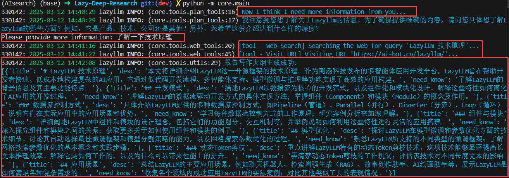
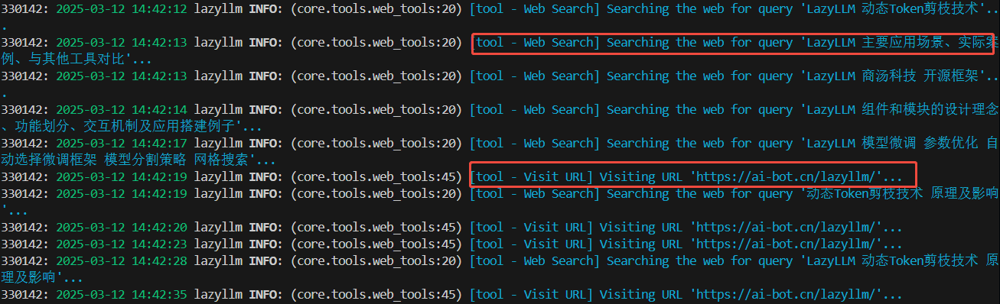
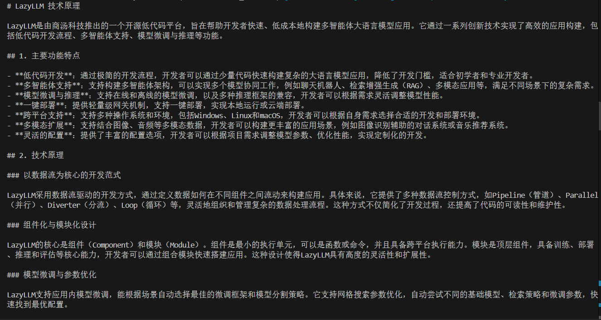

# Lazy-Deep-Research

An opensource deep research agent framework using lazyllm(https://github.com/LazyAGI/LazyLLM)

## Current Func

1. plan agentgive toc according to a challenging topic，during this period，agent may ask user or use web search tools for more infomation.
2. deep search agent
   1. search query using google search provided by lazyllm
   2. select useful link and read text in webpage
   3. gather useful information from text.

## LazyLLM Flow

1. get query
2. let plan agent create report outline
3. set search agents to search and give summary info for each part of report
4. use llm to write and consolidate professional long report.

## Quick Start

1. set qwen api key "export LAZYLLM_QWEN_API_KEY=xxx"
2. set google search api key and search engine id in .env
3. run python -m main

### example

- give a query "介绍一下lazyllm"， plan agent asked user for more information, then search some information from websites, finally give a outline.

- then search agents search every part of outline and give summary information.
- finally, use llm to write long report

  

## Attention!!!
Friendly reminder: Running the deep research process consumes a significant amount of token quota, take care :)

## TODO List

1. web operation
2. memory management
